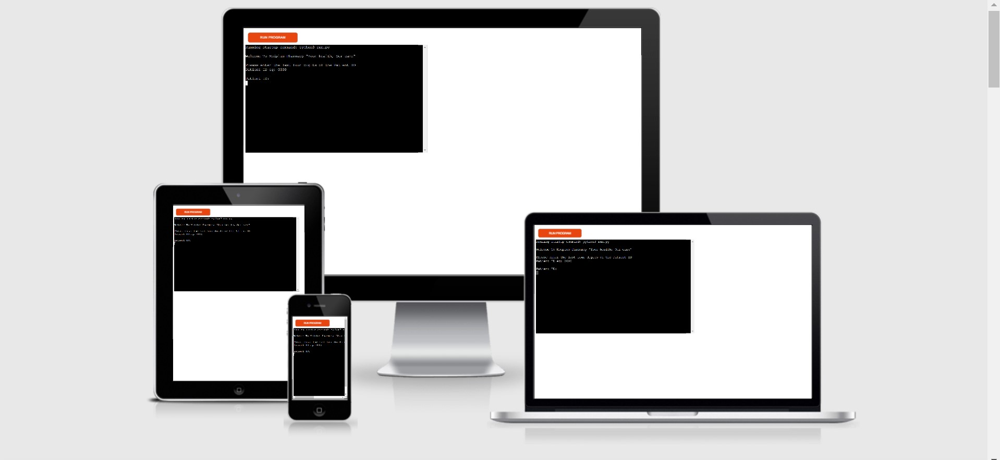
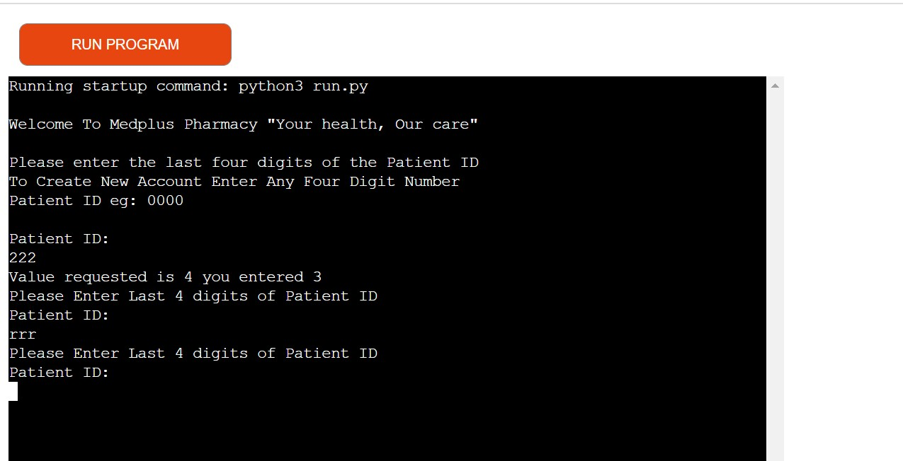
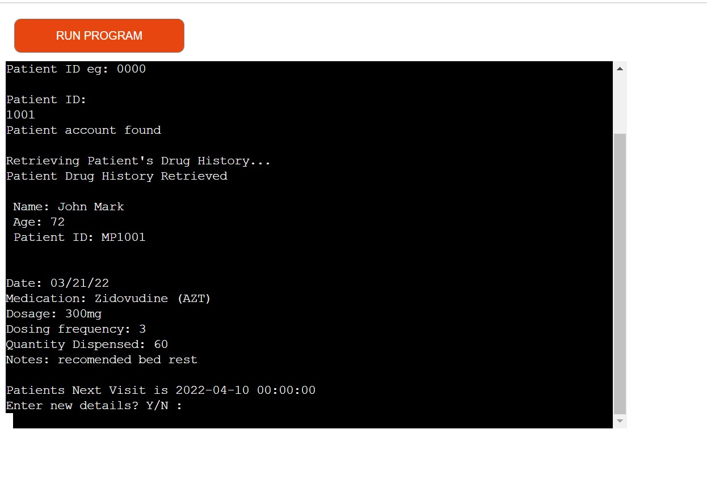
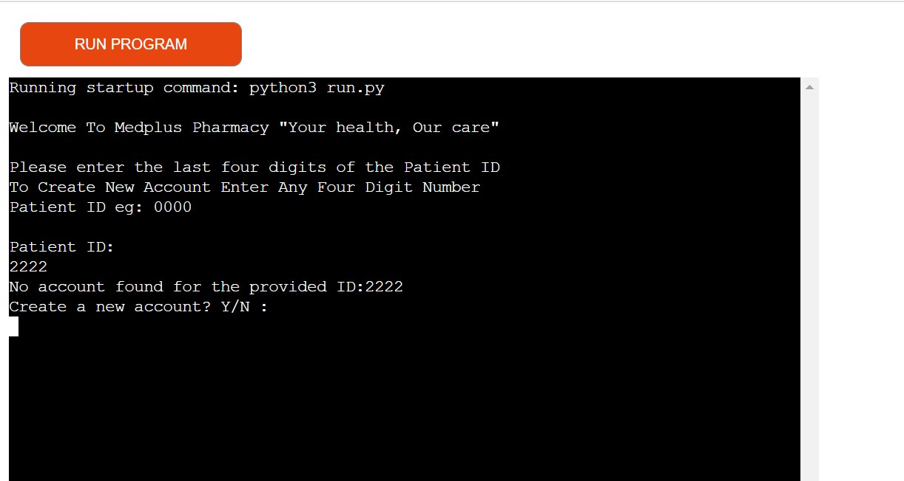
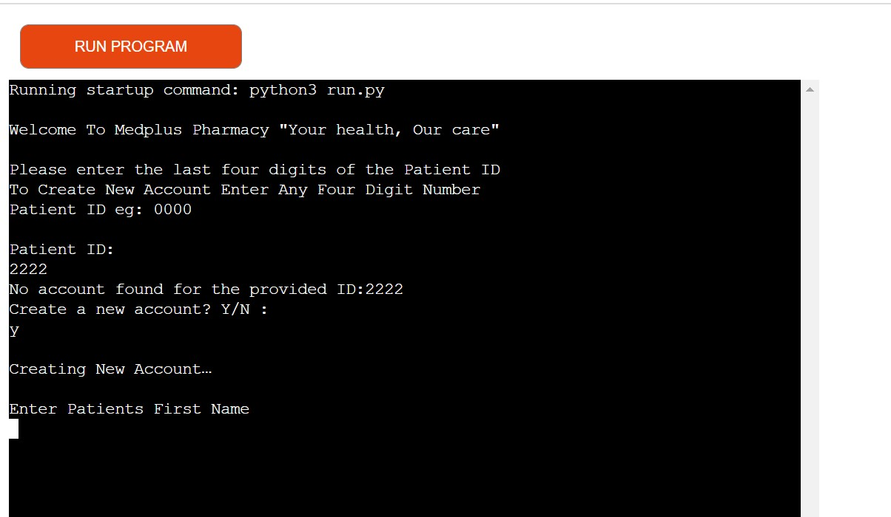
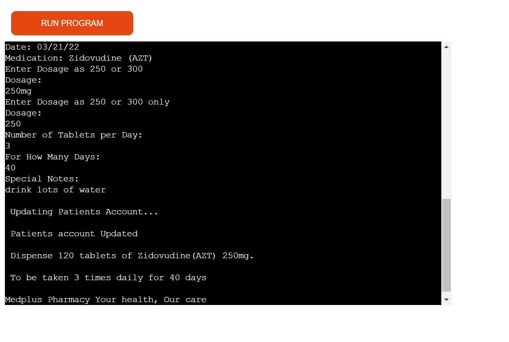
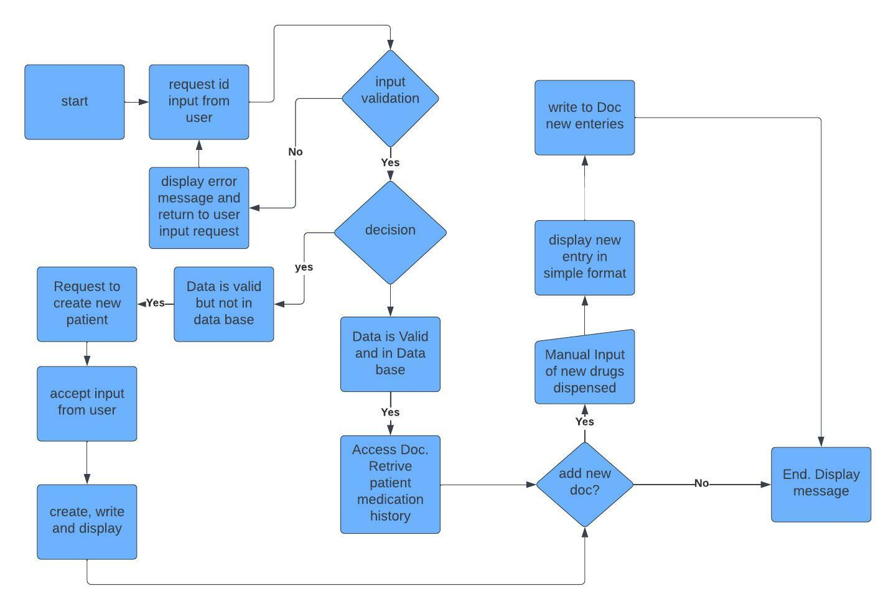

# Medplus Pharmacy

Is an automated data processing app that assist the pharmacist or pharmacy technician in handling medications and minimise medication loss through data analysis and calculation. 

In this project the app has been tailored to assist in dispensing and record keeping of the drug Zidovudine (AZT).

Zidovudine (AZT) is an Antiretroviral drug used in the treatment of HIV/AIDS and prevention of mother-to-child transmission during child birth or in cases of needle stick injury.

Drug loss during dispensing can be caused by a lot of reasons and among them is the error from incorrect record keeping, scheduling of patients visit and incorrect dosing information to patients.
The Medplus Pharmacy app seeks to solve these problems.

The user (pharmacist or pharmacy attendant) matches the patient id recorded in the data base and the information of the patient is displayed on screen this helps the user make an informed decision and chose to record dosing and dispensing information or not.

## Features

Patients are given unique identity and  this serves as a key to verify if the patient is in the data base list or not. It also prevents entering wrong input to gain access to patients information or write into the data base. 

If the patient id matches that in the data base, the patients information is displayed and the patients next visit is calculated with the last visit data.

If the input value is correct but not in the data base the user is prompted to create new account or not.
The user can then follow the on-screen prompt to create and record a new patient account

In the case of existing patients with or without records the user can choose to enter new records for the patient. This records and write the information to a spreadsheet sheet.

The recorded drug information is then displayed with the calculated dosing instruction for the user (pharmacist or pharmacy assistant)

### Features left to implement
* Allow for more than one medication to be enter 
* Allow display of more than one recorded drug entry

### Data Model

The app uses a google doc spreadsheet and google drive API to store and retrieve data. Patient information is stored in the patient’s worksheet and organised columns of Patient ID, First Name, Last Name, Year of Birth. Each patient is assigned a worksheet due to the nature or the drug treatment and disease patient are required to be on medication for series of weeks to a life time thus the need to have individual worksheets assigned to a single patient.

### Testing
I have tested the code by doing the following:
* Passing the codes through a pep8 linter and confirming it has no errors. [pep8online check](pep8http://pep8online.com/checkresult)

* Tested it in my Terminal and the Code Institute Heroku Terminal.
* Entered invalid inputs and wrong inputs where inputs are requested with respect to integers and strings. 
* Recruited help from friends to use app and offer feedback

### Bugs:
Values on the special note input were written in uppercase when I deployed the codes to Heroku this was fixed using the .lower() method. 

### Deployment
The project was deployed to Heroku
. steps
1. create a Heroku account
2.  in the settings section reveal the config var and enter the key and value from the creds.json file
3. Add buildpack for python and nodejs respectively in the order the are listed here.
4. In the deploy section select github and search for the repository name. link up the Heroku app to the github repository code.
5. Scroll down and setup automatic deploy to allow Heroku to update app from gitpod push and click on the manual deploy option.
6. click view to view the app. 

 View app here: [Medplus Pharmacy](https://medplus-pharmacy.herokuapp.com/)

### Credits 
* Code Institute for the deployment terminal [Code Institute](https://codeinstitute.net/ie/)
* [Lucid App](https://lucid.app)
* Ukachukwu Abimbola [@Nurse_Ukachukwu](https://twitter.com/nurse_ukachukwu) for external user testing.